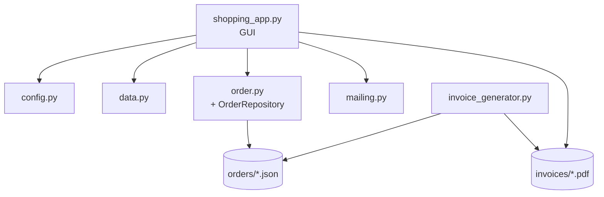

# 🛒 Shopping Cart Application

A Python-based shopping cart GUI with **order persistence**, **PDF invoice generation**, email confirmations, and search — all running on `tkinter`.

Built through 4 improvement phases: from a basic CSV-driven cart to a full order management system with CLI invoicing.

---

## ✨ Features

### 🖥️ GUI (`shopping_app.py`)

| Feature | Details |
|---------|---------|
| **User management** | Name + email input with validation; profile save/load/recovery |
| **Item catalog** | Loads from `items.csv`; real-time search with Clear button |
| **Quantity spinner** | Choose how many to add (1–99) before adding to cart |
| **Cart management** | Add, remove (single/multi), edit quantity via dialog or double-click |
| **Shipping calculator** | Free shipping ≥ €500 & ≤ 50kg; €1.20/kg base + €10 weight penalty |
| **Progress bar** | Visual indicator toward free shipping threshold |
| **Checkout confirmation** | Full order summary review before finalizing |
| **Order history** | Lists past orders; double-click opens PDF; "View JSON" shows raw data |
| **On-demand invoice** | If no PDF exists, generates one automatically via ReportLab |
| **Keyboard shortcuts** | Ctrl+A (add), Delete (remove), Enter (checkout) |
| **Error recovery** | Handles corrupted profile, missing CSV, missing orders gracefully |
| **Window centering** | Main window + all dialogs auto-center on screen |

### 📄 PDF Invoice Generator (CLI)

Separate CLI tool that reads order JSON files and produces professional PDF invoices.

```bash
# Single order
python invoice_generator.py ../orders/order_20260625_203726.json

# Batch — all un-invoiced orders
python invoice_generator.py --batch

# Open generated PDF (Windows)
python invoice_generator.py order.json --open
```

### 📧 Email (optional)

- Sends order confirmation to both **customer** and **shop**
- Uses Gmail SMTP (App Password required for 2FA accounts)
- **Non-blocking** — checkout succeeds even if email fails

---

## 📁 File Structure

```
shop_app/
│
├── shopping_app.py           # Main GUI application (~860 lines)
├── config.py                 # Centralized paths + environment variables
├── data.py                   # CSV loader (load_items, export_items)
├── models.py                 # Dataclasses: Item, ShoppingCart
├── order.py                  # Order dataclass + OrderRepository
├── mailing.py                # SMTP email (optional, imports from config)
│
├── items.csv                 # Product catalog (12 items)
├── .env                      # SMTP credentials (optional)
├── user_profile.json         # Saved user profile (auto-generated)
│
├── invoice_generator/        # CLI PDF generator
│   ├── invoice_generator.py
│   └── requirements.txt
│
├── orders/                   # JSON order output (auto-generated)
├── invoices/                 # PDF output (auto-generated)
├── assets/                   # Icons
│   ├── cart.png
│   └── remove_icon.png
│
├── .gitignore
└── README.md
```

---

## 🛠️ Installation

### Requirements

- Python 3.10+
- `pip` (latest recommended)

### Steps

```bash
# 1. Clone / navigate to the project
cd Test/shop_app

# 2. Install core dependencies
pip install pillow python-dotenv sv-ttk

# 3. (Optional) Install for PDF invoice generation
pip install reportlab
```

---

## ⚙️ Configuration

### Email (optional)

Create a `.env` file in the `shop_app/` directory:

```env
SMTP_EMAIL=your_email@gmail.com
SMTP_PASSWORD=your_app_password
SHOP_EMAIL=shop@example.com
```

> **Note:** Gmail requires an [App Password](https://myaccount.google.com/apppasswords) (not your regular password) when 2-factor authentication is enabled.

### Product Catalog

Edit `items.csv` to customize available products:

```csv
item,weight,cost
banana,1,2
cherry,0.5,1
table,15,250
```

---

## 🚀 Usage

### Launch the GUI

```bash
cd Test/shop_app
python shopping_app.py
```

**Flow:**
1. Enter your name and email (or load saved profile)
2. Browse / search items in the left panel
3. Select an item → choose quantity → add to cart
4. Review cart, edit quantities, remove items
5. Click **Checkout** → review summary → confirm
6. Order saved to `orders/`; PDF can be opened from Order History

### Generate Invoices (CLI)

```bash
cd Test/shop_app/invoice_generator

# Process a single order
python invoice_generator.py ../orders/order_20260625_203726.json

# Process all un-invoiced orders
python invoice_generator.py --batch

# Custom output directory
python invoice_generator.py order.json -o ../my_invoices
```

---

## 🏗️ Architecture



- **`config.py`** — single source of truth for paths and env vars
- **`data.py`** — loads items from `items.csv` into `Item` dataclasses
- **`order.py`** — `Order` dataclass + `OrderRepository` (save/load/list)
- **`mailing.py`** — email via SMTP (imports from `config`, fully optional)
- **`invoice_generator/`** — standalone CLI, uses ReportLab with lazy imports

---

## 🔒 Security Notes

- Email credentials stored in `.env` (gitignored) — never in source code
- User profiles stored locally in `user_profile.json` (gitignored)
- No sensitive data is transmitted except via optional SMTP
- Profile corruption is detected and handled gracefully
- Email is optional and non-blocking — no credentials required to use the app

---

## 📝 License

MIT — feel free to use, modify, and distribute.
