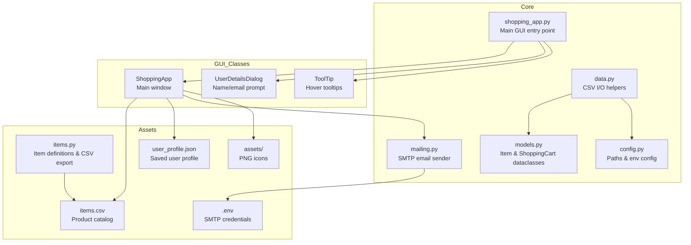
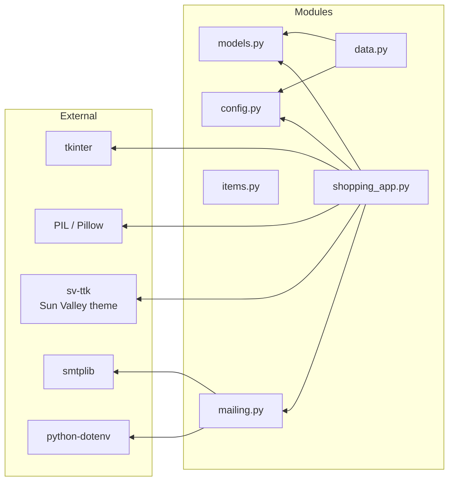
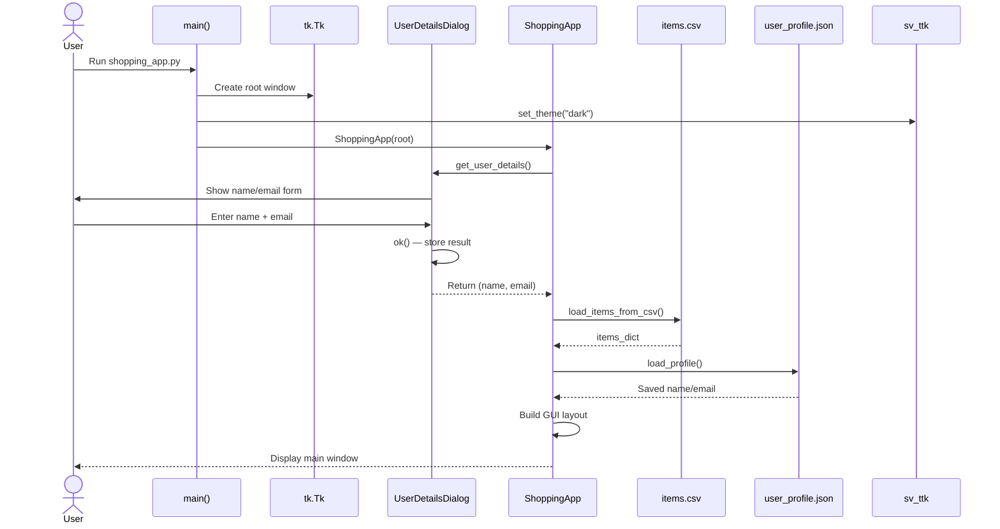
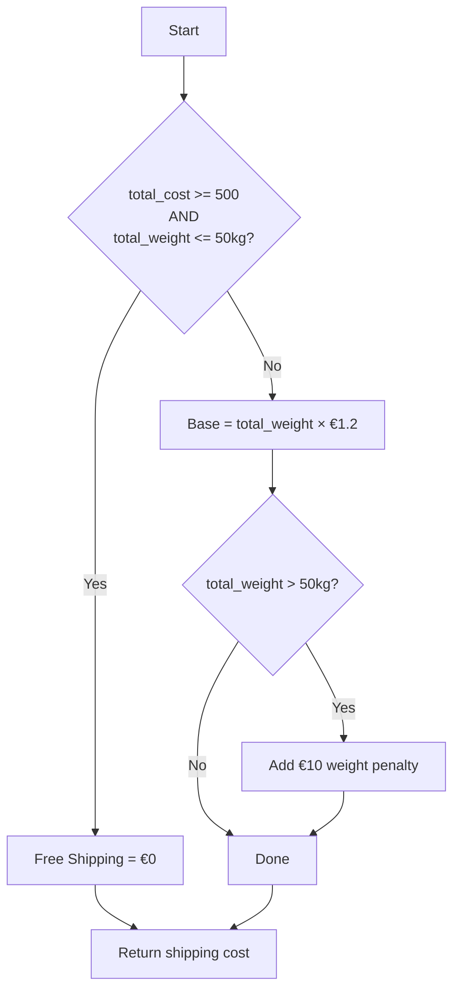
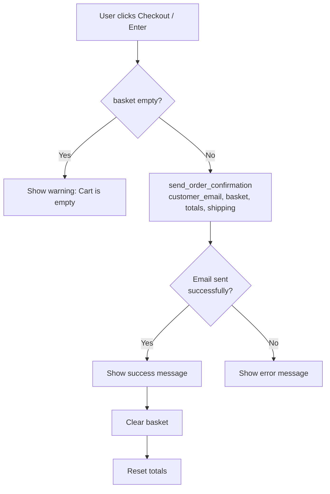
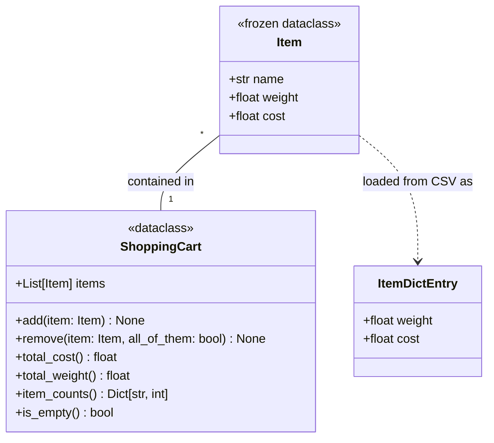

# Shop App Architecture

## File Structure



---

## Class & Module Dependencies



---

## Application Startup Flow



---

## Shopping Cart Data Flow

```mermaid
flowchart LR
    csv[(items.csv)] --> |load_items_from_csv| ShoppingApp
    ShoppingApp --> |select & "Add to Cart"| Basket
    
    subgraph Basket [In-Memory Cart State]
        basket_list[basket: list[str]]
        total_cost[total_cost: float]
        total_weight[total_weight: float]
    end

    Basket --> |update_totals| progress[Progress Bar<br/>Free shipping at €500]
    Basket --> |update_cart_display| cart_listbox[Cart Listbox<br/>item (xCount)]
    Basket --> |calculate_shipping| shipping[Shipping Cost<br/>€1.2/kg + €10 penalty >50kg]

    UserDetailsDialog --> |user_name, user_email| profile_frame[Profile Display]
    profile_frame --> |Save| user_profile_json[(user_profile.json)]
    user_profile_json --> |Load| profile_frame

    Basket --> |checkout| mailing_py
    mailing_py --> |send_order_confirmation| smtp[SMTP gmail]
    smtp --> |email| Customer
    smtp --> |email| Shop
```

---

## GUI Layout

```mermaid
flowchart TD
    subgraph root ["800x600 Main Window (Sun Valley Dark)"]
        direction TB

        profile_frame[Profile Frame<br/>Top-right corner<br/>👤 name / ✉ email + Save Profile]

        subgraph left_panel [Left Column - Items]
            direction TB
            items_label[Available Items]
            items_listbox[Listbox<br/>item: €cost, weight: Nkg]
            search_frame[Search Bar + Button]
            add_btn[Add to Cart<br/>Ctrl+A]
        end

        subgraph right_panel [Right Column - Cart]
            direction TB
            cart_label[Your Cart]
            cart_listbox[Listbox<br/>item (xN)]
            remove_btn[Remove Selected<br/>Delete]
            totals_var[Total Cost / Weight / Shipping]
            progress_bar[Free Shipping Progress Bar]
            checkout_btn[Checkout<br/>Enter]
        end
    end

    left_panel --> |add_to_cart| right_panel
    right_panel --> |edit_cart_item| popup[Double-click: Quantity Dialog]
```

---

## Key Business Logic

### Shipping Calculation (`ShoppingApp.calculate_shipping`)



### Checkout Flow (`ShoppingApp.checkout`)



---

## Data Models



---

## Configuration & Environment

| File | Purpose |
|---|---|
| `config.py` | Base paths (`ITEMS_CSV`, `PROFILE_JSON`), SMTP settings via `dotenv` |
| `.env` | `SMTP_EMAIL`, `SMTP_PASSWORD`, `SHOP_EMAIL` |
| `items.csv` | 12 products (banana, cherry, table, computer, etc.) with weight & cost |
| `user_profile.json` | Persisted `{name, email}` — loaded at startup, saved via button |
| `assets/` | PNG icons used in buttons (`cart.png`, `remove_icon.png`) |

---

## Keyboard Shortcuts

| Shortcut | Action |
|---|---|
| `Ctrl+A` | Add selected item to cart |
| `Delete` | Remove selected cart items |
| `Enter` | Checkout |
| `Double-click` (cart) | Edit item quantity |
